# Project1(汇编程序设计)

> This is the mips project for computer organization

#### 整体功能概览

##### 端口信号说明

端口信号定义如下：

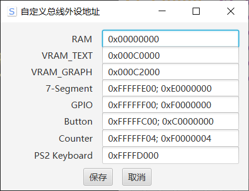

##### text(文本显示模式)：

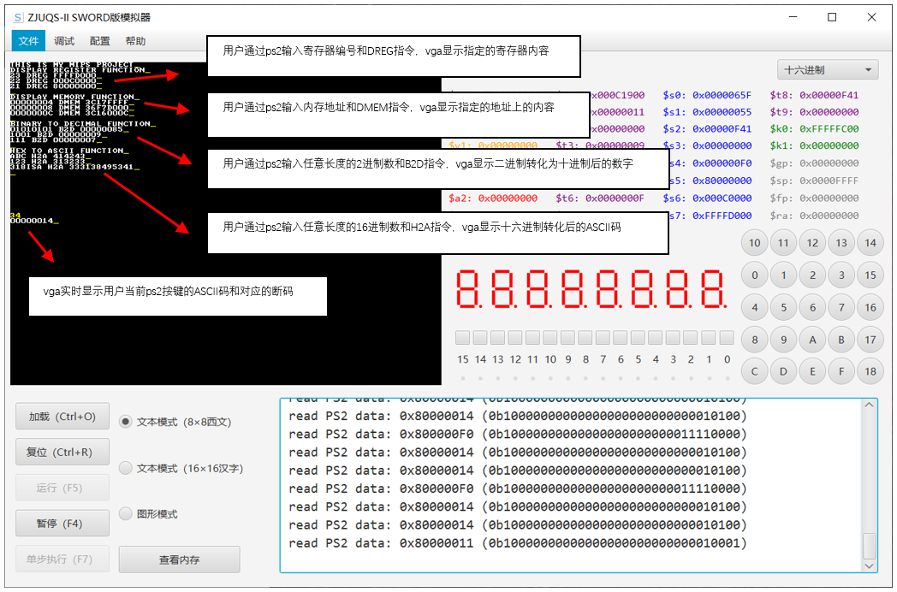

##### graph(图形显示模式)

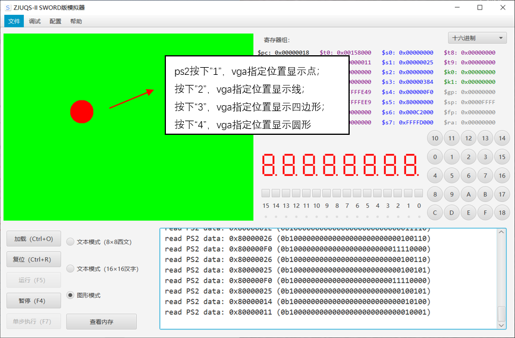

#### 使用方法说明(Text模式)

> 首先把text.coe文件导入模拟器，然后进行下述操作

##### 光标设计说明

这里我设计光标为下划线`_`，为了和其他字符区分得更加明显，我将光标的颜色设计为黄色，当vga显示字符时，光标总是会自动移动到最新的字符末尾

##### 读取ps2键盘并输出对应的字符、ASCII码和扫描码

当用户按下ps2键盘中的某个键时，比如"A"，vga就会在当前光标位置**显示字符**"A"，且**光标右移**一列，此时判断边界，如果到达行末，则新的字符就到下一行开始显示

与此同时，屏幕的左下角会实时更新并显示：

- 当前按键对应字符的**ASCII码**
- 当前按键的**扫描码**(由于字符的通码是相同的，因此这里只显示特有的断码)

> 演示说明

如下图所示，键盘连续按下5个"A"，左上角就出现5个"A"，且黄色光标"_"显示在末尾，左下角第一行显示的是"A"的ASCII码，第二行显示的是“A”扫描码(断码)

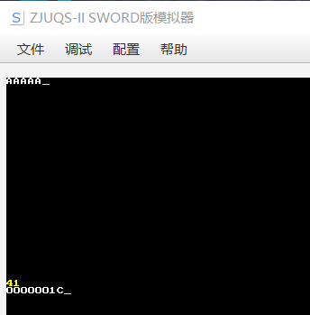

##### 光标的移动

当用户按“**上、下、左、右**”键时，光标也会随之上下左右移动

由于vga的限制，某个确定地址上只能显示一个单独的字符，因此当光标移动到屏幕上的某个点时，该点原先的字符内容势必会被光标所覆盖，为了解决这个问题，我用了一个临时寄存器$t8来存储该位置原先的内容，当光标离开该位置时，原先的内容又会重新显示，这样就实现了**光标的移动不覆盖原先内容**的功能

> 演示说明

- 初始状态，此时光标在最末尾：

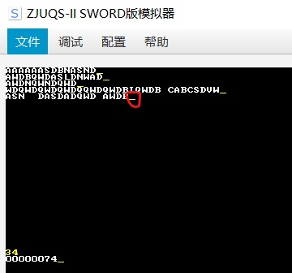

- 按上下左右键移动光标

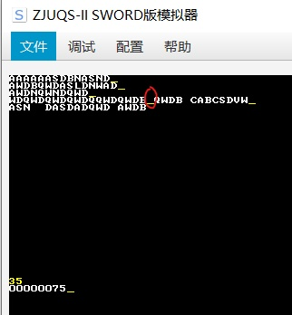

##### 回车换行

如果按下回车键`Enter`，则光标会置于下一行首显示，此时再按下键盘，新的字符将在下一行也就是光标所在处开始显示，光标也会随之更新位置

> 演示说明

下图为按了两次回车后，再输入字符的情况

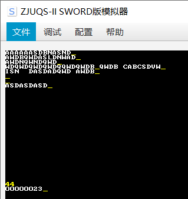

值得注意的是，这里设计了几个子程序，都是通过“指令+回车”的形式来调用的，如果回车前输入了某个特定的指令，则将会调用对应的函数，详细情况将在下面的子程序调用部分说明

##### 屏幕上滚或下滚一行

按下键盘上的`+`加号键，屏幕会上移一行，溢出的内容不再显示

按下键盘上的`-`减号键，屏幕会下移一行，且最上面新增的行复制为当前第一行的内容

> 演示说明

屏幕上移：

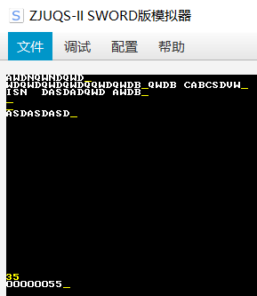

屏幕下移：

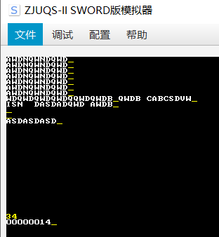

##### 屏幕清屏

当用户按下键盘上的`Esc`键时，屏幕上所有已显示的内容都会被**clear**清屏

> 演示说明

对原先的屏幕按下esc，内容清空：

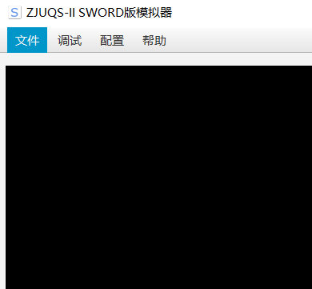

##### 子程序调用1：在屏幕指定位置显示当前寄存器值

我将这个功能适当进行了扩展，目前可以实现在屏幕指定位置显示指定的寄存器值，其中用户只需要输入想要查看的寄存器编号(**1~31**)和`DREG`指令，并按下回车键，就可以显示该寄存器的内容

> 使用说明：

*输入格式：`寄存器编号 DREG`，如: `23 DREG` + 回车 -> 显示第23号寄存器的值*

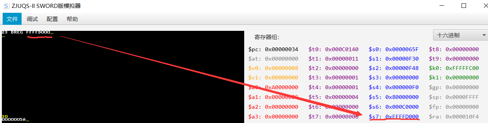

##### 子程序调用2：在屏幕指定位置用16进制显示指定内存单元数据

用户输入想要查看的16进制内存地址(**必须是8位16进制数**)和`DMEM`指令，并按下回车键，就可以显示该地址上的内存单元数据

> 使用说明

*input：8位16进制数，output：屏幕上显示该地址上的内存数据*

*输入格式：`00000008 DMEM` + 回车 -> 显示地址为8的内存数据*

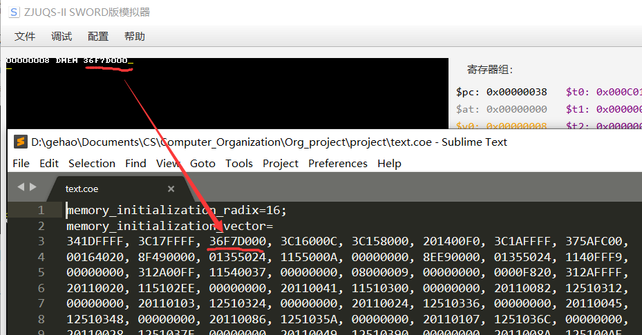

##### 子程序调用3：二进转换为十进制并在屏幕指定位置显示

用户输入任意长度的01二进制字符串和`B2D`指令，并按下回车键，就可以显示该01二进制数转化后的十进制数

> 使用说明

*输入格式：`1111 B2D` + 回车 -> 00000015*

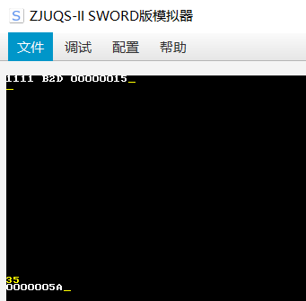

##### 子程序调用4：16进制数转换成ASCII码并在屏幕指定位置显示

用户输入任意长度的16进制数和`H2A`指令，并按下回车键，就可以显示该16进制数转化后的ASCII码

> 使用说明

*输入格式：`ABC H2A` + 回车 -> 414243*

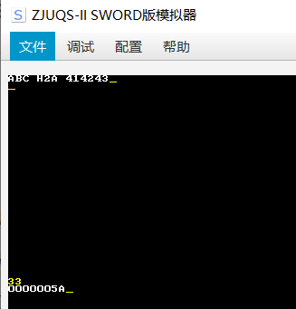

注：以上程序调用前，最好在单独一行内调用

##### 子程序调用5：读取阵列键盘16进制数并在光标处显示

用户按下阵列键盘的16进制数字，就可以在当前光标处显示该字符

注：该程序已经实现，但模拟器的阵列键盘读取似乎有些问题，无法给出最高位的KRDY信号，因此这里暂时无法在模拟器上演示

#### 使用方法说明(graph模式)

> 首先把graph.coe导入模拟器，然后进行下述操作

graph模式的显示比较简单，这里用键盘上的`1`、`2`、`3`、`4`四个按键来切换不同的显示模式

为了让显示的内容更加明显，我把背景色设置为绿色，显示的内容设置为红色

##### 在屏幕指定位置显示一个点。点参数: $a0=0000XXYY

按下键盘上的数字键`1`，就会在屏幕指定位置显示一个点，由于一个点的面积很小，因此需要比较仔细地观察才能看到

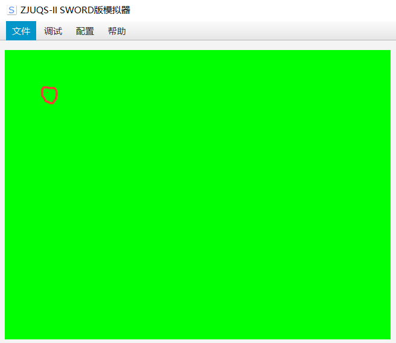

##### 在屏幕指定位置显示直线。端点参数:$a0=XXYYXXYY

按下键盘上的数字键`2`，就会在屏幕指定位置显示一条线

##### 在屏幕指定位置显示四边形。端点参数:\$a0,\$a1=XXYYXXYY

按下键盘上的数字键`3`，就会在屏幕指定位置显示一个四边形

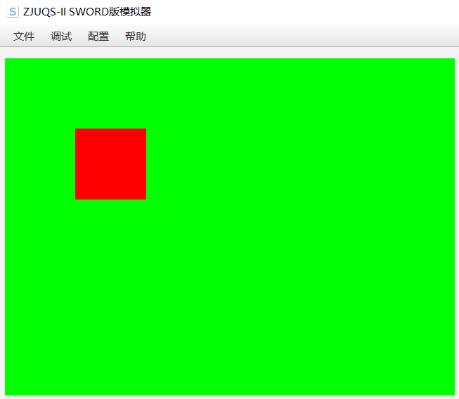

##### 在屏幕指定位置画圆(圆心:\$a0=0000XXYY,半径\$a1)*

按下键盘上的数字键`4`，就会在屏幕指定位置显示一个圆

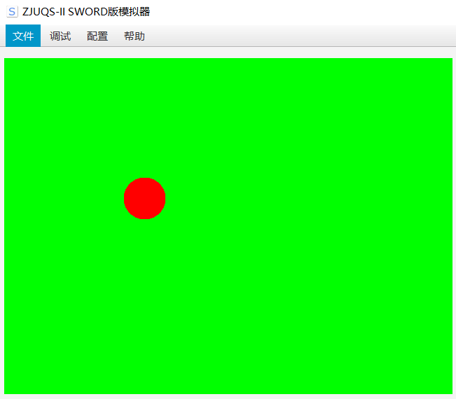

#### 代码和实验总结

##### 实验体会

本次实验对我来说难度其实是非常大的，相对来说汇编器的project做起来会更加轻松一些(因为已经有了一些C++和QT编程的基础)，而这次的汇编project，其实一开始我连题目的意思都没有理解，怎么通过mips读取ps2的键盘码、并转化为对应的ascii码，怎么把数据写到vga上，怎么切换text、graph模式...这些问题我开始做实验的时候是完全不懂的，所以当我听到有同学几天就做完project的时候内心是很绝望的，因为几乎找不到什么能够参考的资料，我光是把这些问题搞清楚、准备开始动手就用了足足一个星期

每次写一个新的功能总是会遇到很多奇奇怪怪的bug，模拟器又没有提供调试功能，我就只能写一个显示过程变量的函数来一步一步地调试，实现一个功能就要花上半天的时间，可能是因为我的基础不太好，也问了老师一些看起来比较傻的问题，花了两个多星期的时间，熬了好几个夜，最终也还是把这个汇编的project给写完了

text mode和graph mode加起来足足有2000+多行的汇编代码，现在看起来也感觉有点不可思议，没想到看似简单的几个问题做起来工程量那么大，老实说，之前我对汇编抱有的是畏惧之心，经过这次project，转变成了敬畏之心

虽然汇编project1花了很多时间，但我觉得是值得的，它让我对后续CPU应用的设计有了一个大体上的认知，也深刻了解了复杂的mips汇编该怎么写，这些都是做汇编器所无法带来的

##### 代码说明

汇编是一门很抽象的语言，因此我在写代码的过程中也十分小心翼翼，几乎每一行代码上面都加上了注释，既是为了加强代码的可读性，同时也避免自己忘记之前写的程序和变量的功能

所以，所有上述描述的函数功能，在`text.s`和`graph.s`汇编文件中都有详细的注释说明，该文档只做了功能使用说明的描述，具体的代码说明可以到汇编文件里查看

#### 附录：模拟器存在的问题

这里在实践的过程中发现了两个模拟器存在的问题：

- 模拟器解析的`li`指令把高16位和低16位的数据位置防反了，因此使用li指令会出错
- 模拟器的阵列键盘模拟存在问题，读取button信号时始终无法提供最高位的KRDY信号